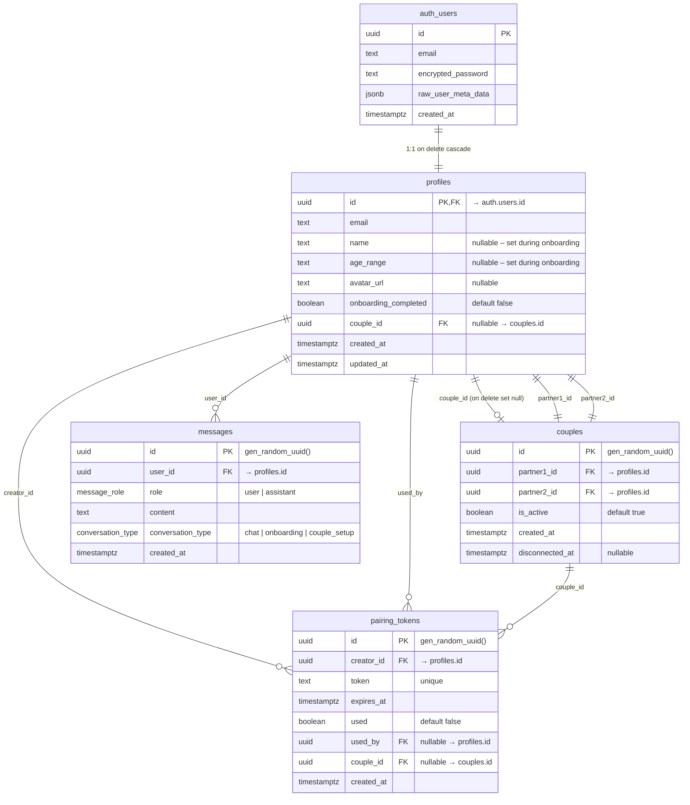

# CoupleGoAI — Database Schema

> **Supabase Declarative Schemas** — SQL source of truth lives in `supabase/schemas/`.
> Run `supabase db diff -f <name>` to generate migrations from these files.

---

## Entity Relationship Diagram



---

## Tables Overview

| Table              | Purpose                                                  | RLS                                                     |
| ------------------ | -------------------------------------------------------- | ------------------------------------------------------- |
| **profiles**       | Public user profile, linked 1:1 to `auth.users`          | Users read/update own profile; read partner's profile   |
| **couples**        | Represents an active or historical partner bond          | Users read own couple; mutations via service role only  |
| **pairing_tokens** | Short-lived QR tokens for partner connection (5 min TTL) | Users read own tokens; mutations via service role only  |
| **messages**       | AI chat & onboarding conversation history                | Users read/insert own messages; no update/delete in MVP |

## Custom Types

| Type                | Values               | Used In                      |
| ------------------- | -------------------- | ---------------------------- |
| `message_role`      | `user`, `assistant`  | `messages.role`              |
| `conversation_type` | `chat`, `onboarding`, `couple_setup` | `messages.conversation_type` |

## Functions & Triggers

| Function                  | Type                           | Purpose                                    |
| ------------------------- | ------------------------------ | ------------------------------------------ |
| `handle_new_user()`       | Trigger on `auth.users` INSERT | Auto-creates a `profiles` row on sign-up   |
| `moddatetime(updated_at)` | Trigger on `profiles` UPDATE   | Auto-sets `updated_at` to `now()`          |
| `get_my_couple_id()`      | Helper (security definer)      | Returns current user's `couple_id` or NULL |
| `get_partner_id()`        | Helper (security definer)      | Returns the partner's `profile.id` or NULL |

## Key Indexes

| Index                        | Table          | Columns                                         | Notes                                  |
| ---------------------------- | -------------- | ----------------------------------------------- | -------------------------------------- |
| `idx_profiles_couple_id`     | profiles       | `couple_id`                                     | Partial: where `couple_id IS NOT NULL` |
| `idx_couples_partner1`       | couples        | `partner1_id`                                   | Partial: where `is_active = true`      |
| `idx_couples_partner2`       | couples        | `partner2_id`                                   | Partial: where `is_active = true`      |
| `idx_pairing_tokens_token`   | pairing_tokens | `token`                                         | Partial: where `used = false`          |
| `idx_pairing_tokens_creator` | pairing_tokens | `creator_id`                                    | —                                      |
| `idx_messages_user_created`  | messages       | `(user_id, created_at DESC)`                    | Primary pagination query               |
| `idx_messages_user_type`     | messages       | `(user_id, conversation_type, created_at DESC)` | Filter by chat vs onboarding           |

## RLS Policy Summary

| Table          | Policy               | Operations | Rule                                         |
| -------------- | -------------------- | ---------- | -------------------------------------------- |
| profiles       | View own profile     | SELECT     | `auth.uid() = id`                            |
| profiles       | View partner profile | SELECT     | Same `couple_id` as caller                   |
| profiles       | Insert own profile   | INSERT     | `auth.uid() = id`                            |
| profiles       | Update own profile   | UPDATE     | `auth.uid() = id`                            |
| couples        | View own couple      | SELECT     | `auth.uid()` in `(partner1_id, partner2_id)` |
| pairing_tokens | View own tokens      | SELECT     | `auth.uid() = creator_id`                    |
| messages       | View own messages    | SELECT     | `auth.uid() = user_id`                       |
| messages       | Insert own messages  | INSERT     | `auth.uid() = user_id`                       |

> **Note:** `couples` and `pairing_tokens` create/update/delete operations are performed by the backend using the **service role key** (bypasses RLS). This ensures pairing logic is fully server-authoritative.

---

## Schema Files

```
supabase/schemas/
├── 00_extensions.sql      ← moddatetime extension
├── 01_types.sql           ← message_role, conversation_type enums
├── 02_profiles.sql        ← profiles table + RLS + indexes
├── 03_couples.sql         ← couples table + profiles FK + RLS
├── 04_pairing_tokens.sql  ← pairing tokens + RLS + indexes
├── 05_messages.sql        ← messages table + RLS + indexes
└── 06_functions.sql       ← triggers + helper functions
```

Files are prefixed numerically for correct dependency ordering (applied lexicographically by `supabase db diff`).

## Getting Started

```bash
# Initialize Supabase (if not already done)
supabase init

# Start local database
supabase start

# Generate a migration from the declarative schemas
supabase db diff -f initial_schema

# Apply the migration
supabase migration up
```
